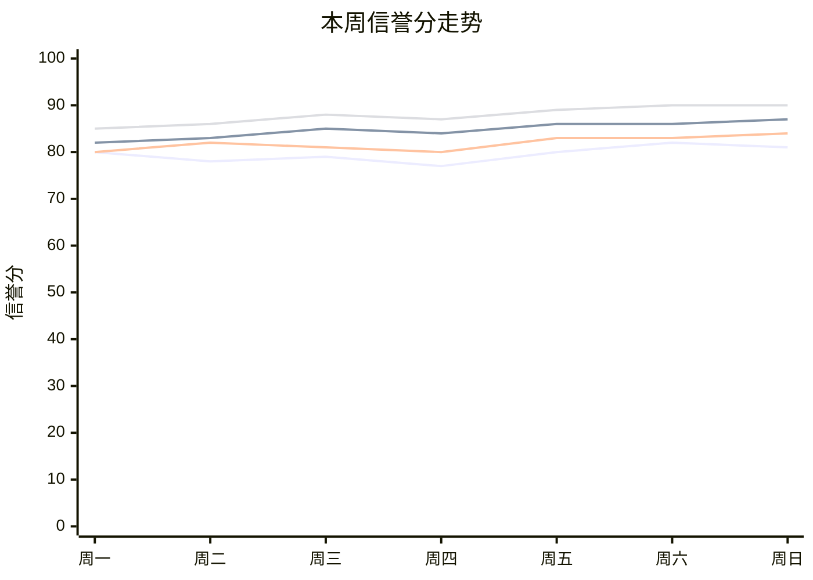

# 📊 第4周 · AI团队工作报告

## 📈 各角色信誉分走势

> 数据将在每周运行后自动填充

## 各角色本周情况

| 角色 | 周初分 | 周末分 | 变动 | 核心问题 |
|------|--------|--------|------|----------|
| 采集师 | 73 | 73 | 0 | - |
| 核查师 | 80 | 80 | 0 | - |
| 分析师 | 86 | 86 | 0 | - |
| 编辑师 | 86 | 86 | 0 | - |

## 🧑‍⚖️ 记忆管理师周评

（本周运行后由管理师填写）

## 🗳️ 管理师评分（四个角色打分）

| 评分角色 | 分数 | 评语 |
|----------|------|------|
| 采集师 | -/10 | - |
| 核查师 | -/10 | - |
| 分析师 | -/10 | - |
| 编辑师 | -/10 | - |

## 🔧 本周规则迭代

---
> 生成时间: 2026/6/28 16:34:32
